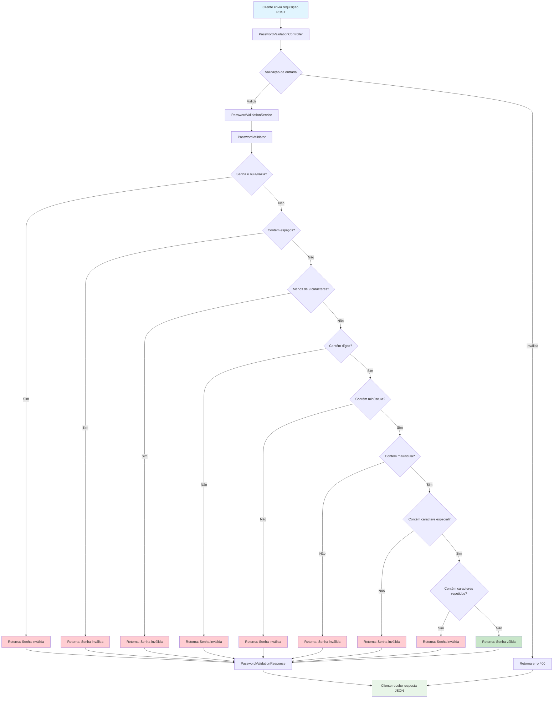
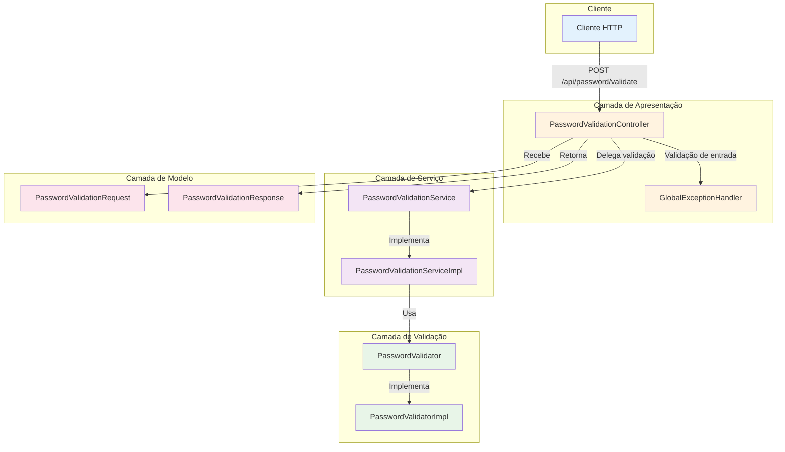

# Validador de Senhas - Desafio Itaú

## Descrição

API REST para validação de senhas seguindo regras específicas de segurança.

## Regras de Validação

Uma senha é considerada válida quando possui:

- **Nove ou mais caracteres**
- **Ao menos 1 dígito**
- **Ao menos 1 letra minúscula**
- **Ao menos 1 letra maiúscula**
- **Ao menos 1 caractere especial** (!@#$%^&\*()-+)
- **Não possuir caracteres repetidos**
- **Não possuir espaços em branco**

## Tecnologias Utilizadas

- **Java 24**
- **Spring Boot 3.5.3**
- **Maven**
- **JUnit 5** (para testes)
- **Lombok** (para redução de boilerplate)
- **SpringDoc OpenAPI** (para documentação Swagger)

## Como Executar

### Pré-requisitos

- Java 24 ou superior
- Maven 3.6+

### Executando a aplicação

```bash
# Clone o repositório
git clone https://github.com/raulmartins/desafioItau.git
cd desafioItau

# Execute a aplicação
./mvnw spring-boot:run
```

A aplicação estará disponível em: `http://localhost:8080`

## Documentação da API

### Swagger UI

A documentação interativa da API está disponível através do Swagger UI:

**URL:** [http://localhost:8080/swagger-ui.html](http://localhost:8080/swagger-ui.html)

O Swagger UI permite:

- Visualizar todos os endpoints disponíveis
- Testar as APIs diretamente no navegador
- Ver exemplos de request/response
- Explorar os modelos de dados

### OpenAPI Specification

A especificação OpenAPI em formato JSON está disponível em:

**URL:** [http://localhost:8080/v3/api-docs](http://localhost:8080/v3/api-docs)

Esta especificação pode ser importada em ferramentas como:

- Postman
- Insomnia
- Outras ferramentas de teste de API

## Fluxo de Validação



## API Endpoints

### POST /api/password/validate

Valida se uma senha atende aos critérios de segurança.

**Request:**

```json
{
  "password": "AbTp9!fok"
}
```

**Response:**

```json
{
  "isValid": true,
  "message": "Senha válida"
}
```

## Exemplos de Validação

| Senha         | Válida | Motivo                                                      |
| ------------- | ------ | ----------------------------------------------------------- |
| `""`          | ❌     | Senha vazia                                                 |
| `"aa"`        | ❌     | Menos de 9 caracteres, sem maiúsculas, dígitos ou especiais |
| `"ab"`        | ❌     | Menos de 9 caracteres, sem maiúsculas, dígitos ou especiais |
| `"AAAbbbCc"`  | ❌     | Sem dígitos ou caracteres especiais                         |
| `"AbTp9!foo"` | ❌     | Caracteres repetidos                                        |
| `"AbTp9!foA"` | ❌     | Caracteres repetidos                                        |
| `"AbTp9 fok"` | ❌     | Contém espaço em branco                                     |
| `"AbTp9!fok"` | ✅     | Atende todos os critérios                                   |

## Executando os Testes

```bash
./mvnw test
```

## Estrutura do Projeto

```
src/
├── main/
│   ├── java/com/desafio/itau/demo/
│   │   ├── controller/     # Controllers REST
│   │   ├── service/        # Lógica de negócio
│   │   ├── model/          # DTOs e entidades
│   │   └── validator/      # Validadores customizados
│   └── resources/
│       └── application.properties
└── test/
    └── java/com/desafio/itau/demo/
        ├── controller/     # Testes de integração
        ├── service/        # Testes unitários
        └── validator/      # Testes de validação
```

## Arquitetura da Aplicação



## Decisões de Arquitetura

### 1. Separação de Responsabilidades

- **Controller**: Responsável apenas pela exposição da API REST
- **Service**: Contém a lógica de negócio de validação
- **Validator**: Implementa as regras específicas de validação

### 2. Princípios SOLID Aplicados

#### **S - Single Responsibility Principle (Princípio da Responsabilidade Única)**

- **`PasswordValidationController`**: Responsável apenas por receber requisições HTTP e retornar respostas
- **`PasswordValidationServiceImpl`**: Responsável apenas pela orquestração da validação
- **`PasswordValidatorImpl`**: Responsável apenas pela aplicação das regras de validação
- **`GlobalExceptionHandler`**: Responsável apenas pelo tratamento de exceções

#### **O - Open/Closed Principle (Princípio Aberto/Fechado)**

- **`PasswordValidator`** (interface): Permite extensão sem modificação do código existente
- Novas regras de validação podem ser implementadas criando novas classes que implementam a interface
- O sistema está aberto para extensão, mas fechado para modificação

#### **L - Liskov Substitution Principle (Princípio da Substituição de Liskov)**

- Qualquer implementação de `PasswordValidator` pode substituir `PasswordValidatorImpl` sem quebrar o comportamento
- Qualquer implementação de `PasswordValidationService` pode substituir `PasswordValidationServiceImpl`

#### **I - Interface Segregation Principle (Princípio da Segregação de Interface)**

- **`PasswordValidator`**: Interface específica para validação de senhas
- **`PasswordValidationService`**: Interface específica para serviços de validação
- Interfaces pequenas e focadas, evitando dependências desnecessárias

#### **D - Dependency Inversion Principle (Princípio da Inversão de Dependência)**

- **Controller** depende da interface `PasswordValidationService`, não da implementação
- **Service** depende da interface `PasswordValidator`, não da implementação
- Dependências injetadas via construtor, facilitando testes e manutenção

### 3. Qualidades de Arquitetura

#### **Abstração**

- **Interfaces bem definidas**: `PasswordValidator` e `PasswordValidationService` abstraem comportamentos
- **DTOs**: `PasswordValidationRequest` e `PasswordValidationResponse` abstraem dados de entrada/saída
- **Camadas de abstração**: Controller → Service → Validator, cada uma com responsabilidade específica

#### **Baixo Acoplamento**

- **Injeção de Dependência**: Classes dependem de interfaces, não de implementações concretas
- **Separação de Camadas**: Mudanças em uma camada não afetam outras
- **DTOs**: Isolam a API externa das estruturas internas
- **Interfaces**: Permitem troca de implementações sem afetar dependentes

#### **Alta Coesão**

- **`PasswordValidatorImpl`**: Todos os métodos trabalham com validação de senhas
- **`PasswordValidationServiceImpl`**: Todos os métodos trabalham com orquestração de validação
- **`PasswordValidationController`**: Todos os métodos trabalham com endpoints de validação
- **`GlobalExceptionHandler`**: Todos os métodos trabalham com tratamento de exceções

#### **Extensibilidade**

- **Novas regras de validação**: Implementar nova classe que implementa `PasswordValidator`
- **Novos tipos de validação**: Criar novas interfaces e implementações
- **Novos endpoints**: Adicionar métodos no controller sem afetar existentes
- **Novos formatos de resposta**: Estender DTOs sem quebrar compatibilidade

### 4. Clean Code

- **Nomes descritivos**: `validatePassword`, `hasRepeatedCharacters`, `containsSpecialCharacter`
- **Métodos pequenos**: Cada método tem uma responsabilidade específica
- **Código auto-documentado**: Nomes de métodos e variáveis explicam a intenção
- **Constantes nomeadas**: `SPECIAL_CHARACTERS`, `MIN_LENGTH`

### 5. Testabilidade

- **Injeção de Dependência**: Facilita mock de dependências nos testes
- **Interfaces**: Permitem criação de mocks para testes isolados
- **Métodos pequenos**: Facilitam testes unitários focados
- **Separação de responsabilidades**: Permitem testes de cada camada independentemente

## Premissas Assumidas

1. **Caracteres especiais**: Considerados apenas os especificados (!@#$%^&\*()-+)
2. **Espaços em branco**: Qualquer tipo de espaço (tab, newline, etc.) é inválido
3. **Case sensitivity**: A validação é case-sensitive
4. **API REST**: Retorna JSON com status HTTP apropriado
5. **Validação**: Senha nula ou vazia é considerada inválida

## Próximos Passos

- [x] Implementar validador de senhas
- [x] Criar controller REST
- [x] Implementar testes unitários
- [x] Implementar testes de integração
- [x] Adicionar documentação Swagger
- [x] Configurar logging
- [x] Implementar tratamento de erros
- [x] Aplicar princípios SOLID e boas práticas de arquitetura
- [ ] Adicionar autenticação e autorização
- [ ] Implementar rate limiting
- [ ] Configurar monitoramento e métricas
- [ ] Deploy em ambiente de produção
